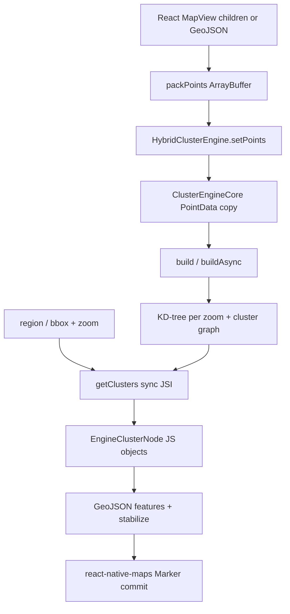

# Architecture

What the library is, where parts live, how bytes move, and Nitro/C++ integration. Algorithm details: [algo.md](algo.md). Aggregation: [aggregation.md](aggregation.md).

## Layers

```
React MapView / Marker children     package/src/compat/MapView.tsx
  Marker children → GeoJSON features (helpers.ts)
    useClusterer                    package/src/hooks/useClusterer.ts
      Supercluster                  package/src/engine/Supercluster.ts
        packPoints → ArrayBuffer    package/src/utils/packPoints.ts
        Nitro HybridObject          ClusterEngine (JSI)
          HybridClusterEngine       package/cpp/HybridClusterEngine.cpp
            ClusterEngineCore       package/cpp/ClusterEngineCore.hpp
              KDTree + zoom hierarchy
        EngineClusterNode[] → GeoJSON
      stabilizeClusterFeatures
  react-native-maps <Marker>        one annotation per visible leaf/cluster
```

Headless callers skip `compat/MapView` and talk to `/hooks`, `/clusterer`, or `/engine`.



**Three cost layers (do not conflate):** C++ compute (`ClusterEngineCore`) → React Marker reconciliation → RN Maps / map-SDK annotation rendering. Details: [performance.md](performance.md).

## File map

| Area | Paths under `package/` |
| --- | --- |
| Root export | `src/index.ts` → `compat/MapView.tsx` |
| Compat MapView | `src/compat/MapView.tsx`, `ClusterMarker.tsx`, `SpiderMarker.tsx`, `helpers.ts`, `throttleRegionSync.ts`, `useFadePresence.ts`, `spiral.ts`, `renderSpiderClusterMarkers.tsx` |
| Hook | `src/hooks/{useClusterer,stabilizeClusters}.ts` |
| Declarative helper | `src/clusterer/Clusterer.tsx` (exported, undocumented — ADR 0001) |
| JS engine wrapper | `src/engine/{Supercluster,geometry,defaults,types}.ts` |
| Nitro spec | `src/specs/ClusterEngine.nitro.ts`, `ClusterEngineOptions.ts`, `EngineClusterNode.ts`, `Viewport.ts`, `ReducerKind.ts` |
| Pack / distance | `src/utils/{packPoints,distance,clusterProperties}.ts` |
| GeoJSON types | `src/geojson/{types,utils}.ts` |
| Hand-written C++ | `cpp/{ClusterEngineCore,HybridClusterEngine,GeoUtils,ArrayBufferPropCopy}.hpp/.cpp` |
| Generated Nitro | `nitrogen/generated/{shared/c++,ios,android}/**` |
| iOS | `NitroMapCluster.podspec` + generated `nitrogen/generated/ios/**` (no hand-written `ios/` clustering) |
| Android | `android/{CMakeLists.txt,build.gradle,fix-prefab.gradle,src/main/cpp/cpp-adapter.cpp,src/main/java/.../NitroMapClusterPackage.kt}` |
| Decisions | `docs/adr/0001-single-mapview-entry-point.md` |

`deriveVisibleMapFeatures.ts` remains in the tree and is tested, but `MapView.tsx` no longer calls it; visible features are the `clusters` array from `useClusterer`.

## Public API surfaces

Subpath exports from `package/package.json`:

| Import | Surface |
| --- | --- |
| `react-native-better-clustering` | default `MapView`, `ClusteredMapViewProps`, `RenderClusterProps` |
| `/compat` | alias of the root export |
| `/hooks` | `useClusterer`, `stabilizeClusterFeatures`, `MapDimensions` |
| `/engine` | `Supercluster`, `createClusterEngine`, defaults, geometry helpers, Nitro types |
| `/geojson` | feature types, `coordsToGeoJSONFeature`, `isClusterFeature` |
| `/utils` | `packPoints`, haversine helpers |
| `/clusterer` | `Clusterer` component |

`MapRegion` lives in `src/types` and is not a package subpath; callers get it through `/hooks` and `/engine` signatures.

### Compat MapView

Drop-in for `react-native-map-clustering`: `react-native-maps` `MapView` plus clustering props. Marker children with `coordinate` and `cluster !== false` become GeoJSON; `cluster={false}` and non-marker children pass through unclustered.

Default radius is `Dimensions.get('window').width * 0.06`, not the engine default of `40`. Engine defaults (`DEFAULT_SUPERCLUSTER_OPTIONS`) apply to `Supercluster` / `useClusterer` when options are omitted.

### Headless engine

`createClusterEngine()` returns `NitroModules.createHybridObject<ClusterEngine>('ClusterEngine')`. Lifecycle: options → packed points → build → query.

`Supercluster` snapshots options at construction, retains `loadedFeatures` for leaf property round-trip, and maps native nodes back to GeoJSON. Cluster features gain `cluster`, `cluster_id`, `point_count`, `point_count_abbreviated`, and `getExpansionRegion`.

Full recipes: [api.md](api.md).

## Ownership

| Resource | Owner | Released by |
| --- | --- | --- |
| Native `ClusterEngine` HybridObject | `Supercluster.engine` / headless caller | `Supercluster.destroy()` sets it to `null` (GC); `useClusterer` cleanup calls `destroy()` |
| `loadedFeatures` array | `Supercluster` | `destroy()` |
| Zoom trees, `_points`, cluster graph | `ClusterEngineCore` | next `setPoints` / `setOptions` / destroying the HybridObject |
| Throttle timer | `compat/MapView` | unmount `cancelThrottledRegionSync` |
| Fade-out timers | `useFadePresence` | unmount / `exitDurationMs === 0` |

`getExternalMemorySize` on `HybridClusterEngine` reports `ClusterEngineCore::memorySize()` so JS GC accounts for native heap.

## Threading

| Thread | Owns |
| --- | --- |
| JS | `packPoints`, `setOptions` / `setPoints` (ingest copy), GeoJSON mapping, React commit, throttle/fade timers |
| Nitro `Promise::async` pool | `buildAsync()` → `ClusterEngineCore::build()` |
| JS (sync JSI) | `build()`, `getClusters`, `getChildren`, `getLeaves`, `getClusterExpansionZoom` |
| Main / UI | `react-native-maps` annotation add/remove; Reanimated cluster opacity (`ClusterMarker`) |

`build()` is synchronous on the **calling** thread. Compat and `useClusterer` use `loadAsync` so the hierarchy build leaves the JS thread. Viewport queries stay on JS.

Do not call `getClusters` from a background thread: JSI converters need the JS runtime.

## End-to-end data flow

```
App points / <Marker> children
      ↓  per dataset change (JS)
markerToGeoJSONFeature or caller GeoJSON
      ↓  Supercluster.prepareEngine (JS)
packPoints → ArrayBuffer (v1 or v2)
      ↓  JSI ArrayBuffer argument
HybridClusterEngine.setPoints
      ↓  memcpy into PointData (native copy; invalid coords dropped)
setOptions → ClusterEngineConfig (native copy of reducers)
      ↓  per dataset change
build() on caller thread  |  buildAsync() on Nitro async pool
      ↓  KD-trees + _clustersByZoom + _nodeById + _childrenByParent
isBuilt = true
      ↓  per region event (JS, sync JSI)
regionToBBox + clusterZoomFromRegion
getClusters(Viewport)
      ↓  KD-tree range → vector<ClusterNode>
toFeature: x/y → lat/lng, EngineClusterNode
      ↓  JSIConverter: one JS object per node
Supercluster.engineFeatureToGeoJSON
      ↓  leaves: original loadedFeatures[pointIndex] reference
      ↓  clusters: new GeoJSON object + getExpansionRegion closure
stabilizeClusterFeatures
      ↓  per React commit
compat MapView clones Marker children / ClusterMarker / spider
      ↓
react-native-maps native annotations
```

### Where data enters

| Caller | Entry |
| --- | --- |
| Default `MapView` | `React.Children` → `markerToGeoJSONFeature` (`properties.index` = child index) |
| `useClusterer` / `Clusterer` | `PointFeature[]` argument |
| Headless `ClusterEngine` | `packPoints(...).buffer` into `setPoints` |

`packPoints` writes little-endian:

- **v1** (no aggregation): `uint32 count`, then per point `int32 index`, `float64 lat`, `float64 lng` (20-byte stride).
- **v2** (values present): magic `0x4E4D4332` (`PACK_POINTS_MAGIC_V2`), count, `numProps`, then per point the v1 fields plus `numProps` float64s.

Point **ids in the buffer are array indices**, not user ids. Leaf properties survive because `Supercluster` keeps `loadedFeatures` and looks up `feature.pointIndex`. Aggregation packing details: [aggregation.md](aggregation.md).

### Copies (verified)

1. **JS pack.** New `ArrayBuffer` + `DataView` writes. Not a view over the original point objects.
2. **Native ingest.** `setPointsFromBuffer` memcpy's each field into `PointData` and projects to `x`/`y`. The JS buffer is not retained.
3. **Build.** Per-zoom `std::vector<ClusterNode>` and `KDTree` copies of `x`/`y` arrays. `_nodeById` stores nodes by id.
4. **Query.** `getClusters` copies matching `ClusterNode`s, then `toFeature` builds `EngineClusterNode` (lat/lng from `yToLat`/`xToLng`, `values` copied).
5. **JSI.** `JSIConverter<EngineClusterNode>::toJSI` constructs a JS object and a JS array for `values`.
6. **GeoJSON.** Cluster nodes become **new** objects. Leaf nodes reuse the original feature when `loadedFeatures[pointIndex]` exists.

"Zero-copy" applies to none of the full pipeline. The ArrayBuffer crossing avoids JSON serialization; it is still followed by native struct copies and per-result JS allocations.

`ArrayBufferPropCopy.hpp` documents that JS-originated ArrayBuffers are only safe to read on the JS thread. Compat does not use it: `setPoints` runs on JS and copies immediately, so `buildAsync` later touches only `PointData`. That ingest ordering does **not** make the engine thread-safe for concurrent build vs query.

### What triggers recomputation

| Trigger | Rebuilds index? | Re-runs `getClusters`? |
| --- | --- | --- |
| `useClusterer` `data` identity, or option primitives / `clusterPropertiesKey` | Yes (`destroy` + `loadAsync`) | After `isLoaded` |
| Compat `children` identity (new element array) | Yes — new `markerFeatures` array | After load |
| Region fields (`lat/lng/deltas`) | No | Yes (`useMemo` in `useClusterer`) |
| `mapDimensions` width/height | No | Yes (zoom from region + size) |
| Compat throttle (`clusterUpdateIntervalMs`) | No | At most once per interval while moving; flush on settle |
| `setOptions` / `setPoints` on a live engine | Clears `isBuilt` until `build` | Queries throw until rebuilt |

`Supercluster.load` / `loadAsync` throw if called twice on the same instance. Partial marker updates are a full reload.

### Viewport and React render path

JS converts `MapRegion` → bbox with `center ± latitudeDelta` / `center ± longitudeDelta` (`geometry.ts`). That is **twice** the `react-native-maps` visible span per axis (4× area). Comments mark this as react-native-clusterer parity. Consequences: [algo.md](algo.md).

`getClusters` in C++ range-queries the result KD-tree at `floor(zoom)` clamped to `[minZoom, maxZoom]`. Antimeridian split runs only when `west > east`; `regionToBBox` never produces that shape.

Compat `MapView`:

- Unclustered leaves: `React.cloneElement` of the original `Marker` child, keyed `marker-${index}`.
- Clusters: default `ClusterMarker` (Reanimated native `opacity`) or `renderCluster`.
- At `maxZoom` with `spiralEnabled`, clusters whose expansion zoom is still `>= maxZoom` spiderfy via `renderSpiderClusterMarkers`.
- `useFadePresence` keeps exiting default bubbles mounted when fade-out > 0; while `isMapMoving`, fade-out is forced to 0 so zoom does not stack generations.

`onMarkersChange` fires from the stabilized `clusters` array. `onRegionChangeComplete` is deferred until that array matches the settled region, so the engine is not queried a second time for the callback.

### Allocation pressure

Hot allocations on a pan tick (default 100 ms):

- `EngineClusterNode` JS objects × visible node count (padded bbox)
- GeoJSON cluster objects that failed stabilization
- React elements for markers that failed identity reuse
- Native annotation add/remove inside `react-native-maps`

Hot allocations on a dataset change:

- `ArrayBuffer` of size `4 + n*20` (v1) or `12 + n*(20+8p)` (v2)
- Native `_points` + per-zoom trees (`memorySize()`)
- Full `loadAsync` + React tree replacement

GC: native bytes are advertised through `getExternalMemorySize`. JS retains `loadedFeatures` for the life of `Supercluster`.

## Nitro contract

`package/src/specs/ClusterEngine.nitro.ts` declares `ClusterEngine extends HybridObject<{ ios: 'c++', android: 'c++' }>`.

`package/nitro.json` autolinks:

```json
"ClusterEngine": {
  "all": {
    "language": "c++",
    "implementationClassName": "HybridClusterEngine"
  }
}
```

JS: `NitroModules.createHybridObject<ClusterEngine>('ClusterEngine')` (`createClusterEngine`, `Supercluster.prepareEngine`).

Adding a method: edit the spec → `cd package && bun run specs` → implement on `HybridClusterEngine` → wrap in `Supercluster` / hooks if it is public.

Generated output under `package/nitrogen/generated/` is committed. Hand-edits are overwritten on the next `specs` run.

### C++ types

| Type | File | Notes |
| --- | --- | --- |
| `HybridClusterEngine` | `cpp/HybridClusterEngine.{hpp,cpp}` | Nitro entry; owns `ClusterEngineCore` |
| `ClusterEngineCore` | `cpp/ClusterEngineCore.hpp` (header-only) | Algorithm |
| `GeoUtils.hpp` | projection, reducers, `PointData`, `ClusterNode`, `ViewportBounds` | |
| Generated structs | `nitrogen/generated/shared/c++/{EngineClusterNode,Viewport,ClusterEngineOptions,ReducerKind,HybridClusterEngineSpec}.*` | `JSIConverter` specializations |

`ReducerKind` switch in `HybridClusterEngine.cpp` must stay exhaustive when the spec gains a variant.

### Autolinking

**iOS.** Podspec `NitroMapCluster`:

- `ios/**/*.{m,mm}` (registration lives in generated nitrogen, not a hand-written engine)
- `cpp/**/*.{hpp,cpp}`
- `load nitrogen/generated/ios/NitroMapCluster+autolinking.rb`
- deps: `React-jsi`, `React-callinvoker`, `install_modules_dependencies`
- **No explicit C++ optimization flags** in the podspec — Xcode Debug vs Release compiler settings apply to the engine sources

**Android.** `NitroMapClusterPackage.kt` is an empty `BaseReactPackage` whose `companion init` loads `libNitroMapCluster.so`. `cpp-adapter.cpp` `JNI_OnLoad` → generated `registerAllNatives()`. CMake builds the shared lib from `cpp-adapter.cpp`, `HybridClusterEngine.cpp`, and nitrogen autolinking. `fix-prefab.gradle` exists so consuming apps get the `.so` in prefab, not a headers-only package.

`package/android/build.gradle` sets native `cppFlags`: Debug `-O1 -g`, Release `-O2`.

`react-native.config.js` plus Nitro autolinking are the integration path. No extra native code is required in the app beyond New Architecture and peers.

### Lifetime

- Each `createHybridObject('ClusterEngine')` owns one `ClusterEngineCore`.
- `setPoints` / `setOptions` clear derived indexes (`_built = false`).
- `destroy()` on `Supercluster` drops the JS handle; native memory is released when the HybridObject is destroyed/GC'd.
- `getExternalMemorySize` returns `memorySize()` so Hermes/V8 can account for C++ heap.

Native owns `_points`, per-zoom `_resultTrees` / `_clustersByZoom`, `_nodeById`, `_childrenByParent`. JS owns `loadedFeatures` for the Supercluster lifetime. Dataset replacement without `destroy()` leaks the previous engine until GC.

## Thread safety (CRITICAL)

```text
ClusterEngineCore is NOT thread-safe.
No mutex / lock / atomic protects build state.

Do not issue concurrent buildAsync / getClusters / getChildren / getLeaves /
getClusterExpansionZoom / isBuilt against the same engine instance.

Supercluster lifecycle gating is incidental protection only.
createClusterEngine() (headless) provides no such guarantee.
```

`buildAsync` moves work off the JS thread — that is **not** concurrent-query safety.

### Source facts

- `ClusterEngineCore::build()` clears and rebuilds `_clustersByZoom`, `_resultTrees`, `_nodeById`, `_childrenByParent`, and sets `_built` with **no** mutex, lock, or atomics in the header.
- `HybridClusterEngine::buildAsync` is `Promise<void>::async([this]{ _engine.build(); })` — `build()` runs on a Nitro async worker while the same `_engine` remains reachable from JS.
- Ingest already copied points into `_points` on the JS thread before `buildAsync`, so the worker does not read the JS `ArrayBuffer`. That does **not** make concurrent query/build safe.
- Queries (`getClusters` / `getChildren` / `getLeaves` / `getClusterExpansionZoom`) call `requireBuilt` then read the maps that `build()` mutates.

### What the Supercluster / MapView path actually protects

Incidental lifecycle gates (not a lock):

- `load` / `loadAsync` throw if called twice on one instance.
- `isLoaded` is `engine?.isBuilt ?? false`.
- `useClusterer` returns `[]` until `isLoaded`; `getClustersFromRegion` returns `[]` when `!isLoaded`.

Gaps still present in source:

- `loadAsync` assigns `this.engine` **before** `await engine.buildAsync()` completes. Direct `getClusters` / `getChildren` / `getLeaves` only check `engine != null` (`throwIfNotInitialized`), not `isBuilt`, so they can race an in-flight `buildAsync`.
- Headless `createClusterEngine()` exposes the HybridObject with **no** JS lifecycle gate — callers must serialize build vs query themselves.

### Safe sequence (single engine)

```text
setOptions → setPoints → await build / buildAsync → then query
Stop all queries before the next setOptions / setPoints / rebuild.
```

Do **not** poll `isBuilt` concurrently with `buildAsync` as synchronization. Do **not** move JSI conversion or `getClusters` to a background thread.

### Dual-engine swap (continuous query during rebuild)

When the app must keep answering queries while a new index is built:

```text
1. Keep engine A as the live query target.
2. Create engine B (new createClusterEngine / Supercluster).
3. Fully configure B: setOptions → setPoints → await buildAsync to completion.
4. Only after B is built, swap the live pointer A → B.
5. Destroy A when no longer referenced.
```

Never query B while it is still building. Never overlap build and query on A or B. The swap is a JS-owned pointer change after B is ready — not a lock inside `ClusterEngineCore`.

## Error strings (exact)

From `HybridClusterEngine.cpp`:

```text
ClusterEngine: call build() or buildAsync() before querying. Check isBuilt when the engine state is unclear.
```

Also thrown for null/invalid `setPoints` buffers and unsupported `ReducerKind` (see source for exact wording). Do not paraphrase errors inside quotation marks.

## Native dependencies

| Dependency | Why |
| --- | --- |
| `react-native-nitro-modules` | HybridObject runtime, `ArrayBuffer`, `Promise::async` |
| New Architecture | Nitro requirement |
| C++20 | `ClusterEngineCore.test.cpp` and Android `CMAKE_CXX_STANDARD 20` |

Not used by the clustering native layer: MapKit, Google Maps SDK, Reanimated. Those belong to `react-native-maps` / JS cluster bubbles.

## Common native failure modes

- Old Architecture / Expo Go: module does not load.
- `nitrogen` output stale after a spec edit: missing symbols at link or runtime.
- Android prefab without `fix-prefab.gradle`: app cmake cannot see `libNitroMapCluster.so`.
- Calling query methods before `build`: native `runtime_error` surfaced to JS (exact string above).
- `setPoints(null)` or a buffer not from `packPoints`: native throw.
- Concurrent `buildAsync` + query on the same engine: undefined behaviour — see thread-safety section.

## Platform assumptions

- React Native 0.78+, New Architecture required.
- iOS and Android. No web implementation.
- Expo: development build only. This package has no Expo config plugin; the example uses the `react-native-maps` plugin.
- Rendering peer: `react-native-maps`. Reanimated >= 4 and `react-native-worklets` >= 0.6 for default cluster fade.

Install and platform deltas: [setup.md](setup.md), [debugging.md](debugging.md).
